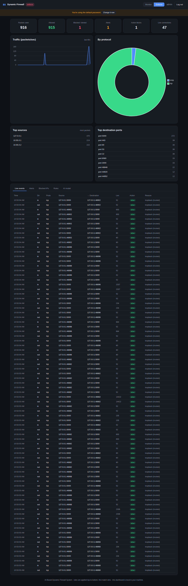
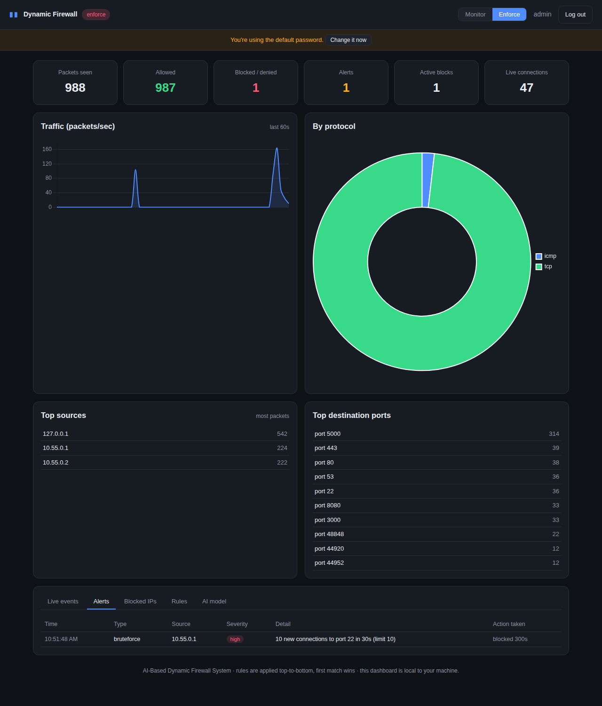
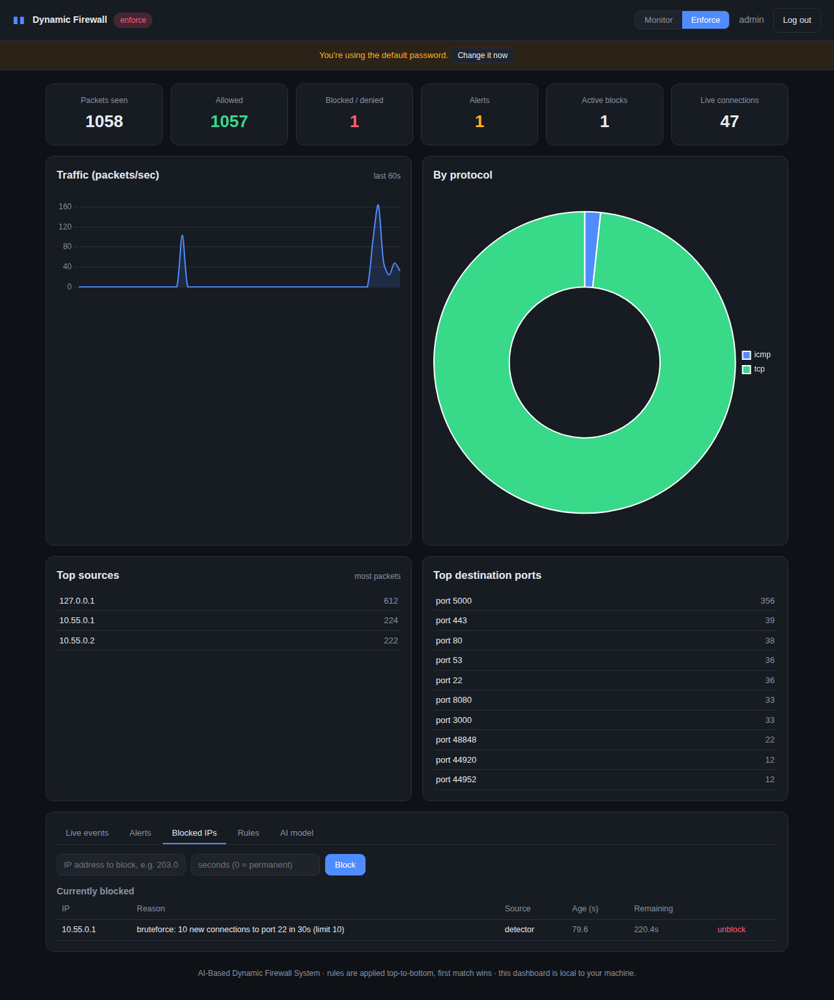
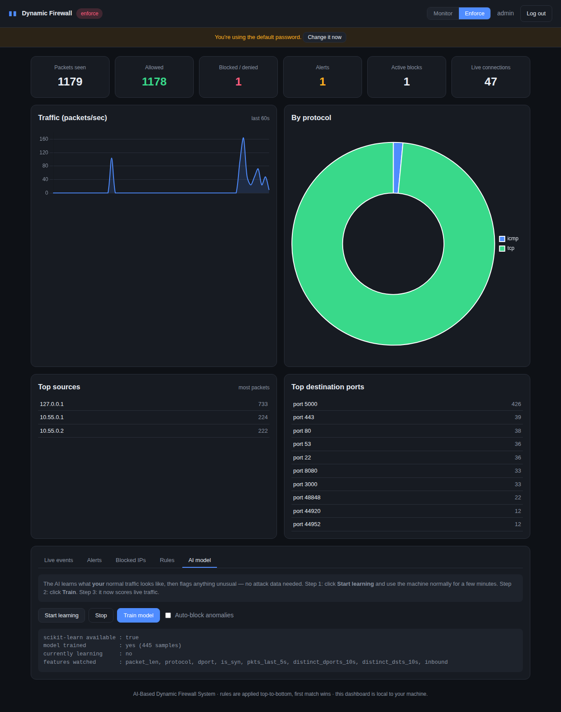

# AI-Based Dynamic Firewall System

A **real, working host firewall** for Linux, written in Python, with a live web
dashboard and an AI layer that learns your normal traffic and flags what doesn't
fit.

Unlike a demo that only *pretends* to see attacks, this version sits in the real
packet path: the Linux kernel hands it **every** packet and this program decides,
packet by packet, whether to **allow** or **block** it. You can test it with
real traffic — either from a second device, or on a single machine using the
built-in lab (see [Demo](#demo)).

> **What changed from the earlier version?** The previous code generated fake
> attacks with `random` and only ever filtered those fakes; its machine-learning
> model was trained on eight hand-typed rows; and the dashboard/templates were
> empty files. This version removes all of that and replaces it with a genuine
> packet-filtering engine, real detection, an unsupervised AI model, and a
> complete dashboard. See [`HOW_IT_WORKS.md`](HOW_IT_WORKS.md) for the full
> explanation in plain language.

---

## What it does

- **Filters real traffic by rules** — an ordered allow/deny/reject list matched
  top-to-bottom (first match wins), on direction, protocol, IP/CIDR and ports.
- **Is stateful** — replies to connections *you* started are allowed
  automatically, the way a proper firewall behaves.
- **Blocks dynamically** — when something misbehaves, its address is dropped in
  the kernel instantly (via `ipset`), with an optional auto-expiry.
- **Detects unwanted behaviour** — port scans, SYN/UDP/ICMP floods, and
  brute-force attempts on login ports. Every alert says exactly which threshold
  was crossed.
- **Learns your normal traffic (the AI part)** — an unsupervised anomaly model
  (Isolation Forest) learns what your machine's traffic normally looks like and
  flags anything unusual. **No attack data required.**
- **Has a live dashboard** — traffic charts, top talkers, live events, alerts,
  block management, rule editing and AI controls, with secure login.
- **Is safe to run** — starts in *monitor* mode (watches only, never drops),
  fails open if it crashes, protects loopback/gateway/DNS from being blocked,
  and removes every kernel rule it added when it stops.

---

## How it works (in one picture)

```
        the network
             │  every packet
             ▼
   ┌───────────────────┐   iptables sends each packet to NFQUEUE
   │   Linux kernel     │──────────────┐
   └───────────────────┘               │
             ▲                          ▼
   verdict:  │                 ┌──────────────────┐
   accept /  │                 │  this program     │
   drop      └─────────────────│  (Python engine)  │
                               └──────────────────┘
                                 │  for each packet:
                                 │  1. stateful check (is it a reply we expected?)
                                 │  2. is the source already blocked?
                                 │  3. rules: allow / deny / reject
                                 │  4. detectors: scan? flood? brute force?
                                 │  5. AI: does this look normal?
                                 ▼
                          allow it, or block it
```

Full plain-language walkthrough: [`HOW_IT_WORKS.md`](HOW_IT_WORKS.md).

---

## Requirements

- **Linux** (tested on Kali/Ubuntu 24.04). It must be Linux, because the packet
  interception uses Linux's NFQUEUE. A VM (VirtualBox/UTM/VMware) is perfect.
- **Root** (the firewall installs kernel rules).
- Python 3.9+.

System packages and Python libraries:

```bash
sudo apt update
sudo apt install -y iptables ipset libnetfilter-queue-dev python3-dev build-essential nmap
python3 -m venv venv && source venv/bin/activate
pip install -r requirements.txt
```

---

## Quick start

```bash
# 1) Start the firewall + dashboard (monitor mode = watch only, nothing blocked)
sudo python3 run.py

# 2) Open the dashboard
#    http://127.0.0.1:5000     (default login: admin / admin — you'll be asked to change it)

# 3) When you're ready to actually block, click "Enforce" in the dashboard
#    (or start with:  sudo python3 run.py --mode enforce)

# Stop any time with Ctrl+C — all kernel rules are removed automatically.
```

Other options:

```bash
sudo python3 run.py --mode enforce   # start already blocking
sudo python3 run.py --no-web         # engine only, no dashboard
python3 run.py --web-only            # dashboard only (view history, no root needed)
sudo python3 tools/cleanup.py        # remove leftover rules after a hard kill
```

---

## Demo

### Option A — one machine, no extra hardware (recommended for a quick check)

This builds two tiny virtual "computers" inside your machine (using network
namespaces), runs the real firewall on one, and sends **real** traffic —
including a real `nmap` scan — from the other:

```bash
sudo python3 tools/lab.py
```

Expected output:

```
  [PASS]  normal ping is allowed
  [PASS]  normal TCP connection is allowed
  [PASS]  port scan was detected and the scanner blocked
  [PASS]  traffic from the blocked scanner is now stopped
```

### Option B — two devices (the most convincing demo)

1. Run the firewall on machine A (your VM): `sudo python3 run.py --mode enforce`
2. From machine B (same network), send real traffic at machine A:
   ```bash
   ping <A-ip>                       # allowed
   nmap -sS -p 1-1000 <A-ip>         # triggers the port-scan detector -> B gets blocked
   ```
3. Watch it happen live on machine A's dashboard (Alerts and Blocked IPs tabs).

> Only ever scan or flood machines you own. This is standard, legitimate
> firewall testing against your own equipment.

---

## Screenshots

| | |
|---|---|
|  |  |
| Live overview: traffic chart, protocol split, top talkers, live events | Alerts: a real brute-force attempt caught and blocked |
|  |  |
| Blocked IPs: manual block/unblock and the active list | AI model: learn → train → protect, trained on real traffic |

---

## Using the dashboard

| Tab | What you can do |
|-----|-----------------|
| **Live events** | See packet decisions as they happen (allow/deny + the reason). |
| **Alerts** | Every detector/AI alert, with the exact reason and what action was taken. |
| **Blocked IPs** | See who's blocked, block an address by hand, or unblock. |
| **Rules** | Add, view and delete rules. Rules apply top-to-bottom, first match wins. |
| **AI model** | Start learning, train the model, and turn on auto-blocking of anomalies. |

The **Monitor / Enforce** switch (top right) controls whether the firewall only
watches, or actually blocks.

### Training the AI (3 steps)

1. Open the **AI model** tab and click **Start learning**.
2. Use the machine normally for a few minutes (browse, update, whatever is
   normal for it). The model is collecting examples of *your* normal traffic.
3. Click **Train model**. From now on it scores live traffic and flags anything
   that doesn't look like what it learned. Optionally tick **Auto-block
   anomalies** to have it act on its own.

---

## Project structure

```
AI-based_Dynamic_Firewall_System/
├── run.py                  # start everything (engine + dashboard)
├── requirements.txt
├── README.md
├── HOW_IT_WORKS.md         # plain-language explanation of every part
├── fwcore/                 # the firewall engine
│   ├── packet.py           # read raw packet bytes into fields
│   ├── rules.py            # the ordered allow/deny rule engine
│   ├── conntrack.py        # stateful connection tracking
│   ├── detectors.py        # port-scan / flood / brute-force detection
│   ├── blocklist.py        # dynamic, self-expiring blocks (+ safelist)
│   ├── ai.py               # the unsupervised anomaly model
│   ├── netfilter.py        # iptables / ipset / NFQUEUE plumbing
│   ├── engine.py           # the per-packet decision pipeline
│   ├── storage.py          # SQLite history for the dashboard
│   ├── stats.py            # live counters
│   └── config.py           # settings
├── web/                    # the dashboard
│   ├── server.py           # Flask app + JSON API (login, CSRF-protected)
│   ├── auth.py             # hashed-password accounts
│   ├── templates/          # login + dashboard pages
│   └── static/             # style.css, app.js, Chart.js (vendored, offline-safe)
├── tools/
│   ├── lab.py              # single-machine real-traffic demo
│   └── cleanup.py          # remove leftover kernel rules
├── tests/
│   └── test_core.py        # unit tests for the core logic
└── data/                   # created at runtime (config, rules, logs, model)
```

---

## Safety notes

- **Monitor mode is the default.** Nothing is dropped until you switch to
  Enforce. Good for watching a live machine with zero risk.
- **Fail-open.** If the firewall process dies, the kernel rule lets traffic
  through (so you can't lock yourself out of a remote box). This is configurable.
- **You can't block yourself off.** Loopback, your gateway and your DNS servers
  are safelisted and can never be blocked.
- **Clean teardown.** Ctrl+C removes every rule. If it was killed hard, run
  `sudo python3 tools/cleanup.py`.

---

## Troubleshooting

- **`required tool 'ipset' not found`** → `sudo apt install ipset iptables`.
- **`NetfilterQueue` import/build error** → `sudo apt install libnetfilter-queue-dev python3-dev build-essential`, then `pip install -r requirements.txt`.
- **"This needs root"** → run with `sudo`.
- **Dashboard shows no traffic** → on a quiet VM there may be little traffic; generate some (`ping`, open a website) or run `sudo python3 tools/lab.py`.
- **Leftover rules after a crash** → `sudo python3 tools/cleanup.py`.
- **The AI tab says "model trained: no"** → follow the 3 training steps above; it needs at least ~200 samples.

---

## Testing

```bash
python3 tests/test_core.py          # unit tests (no root needed)
sudo python3 tools/lab.py           # full real-traffic integration demo
```
